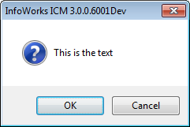

{ALL}

# WSApplication

The top-level of the application in scripts run from the User Interface and Exchange.

This is a static class, meaning that methods are used anywhere in your scripts with `WSApplication.method_name` syntax. Most methods are used to get/set global application settings, or create/open databases.

**Methods:**

{{toc}}

## add_ons_folder

```ruby
#add_ons_folder ⇒ String
```

`EXCHANGE`, `UI`

Returns the full path of the add-ons folder e.g.

`C:\Users\badger\AppData\Roaming\Innovyze\WorkgroupClient\scripts`

Note that the folder will not exist unless manually created. Its parent folder will almost certainly exist.

**Parameters**

| Name   | Type(s) | Description |
| ------ | ------- | ----------- |
| Return | String  |             |

{::ICM}

## background_network

```ruby
#background_network ⇒ WSOpenNetwork?
```

`UI`

Returns the active background network, which will be from the GeoPlan that currently has focus.

{::/ICM}

{::ICM}

## cancel_job

```ruby
#cancel_job(id) ⇒ void
```

`EXCHANGE`

Cancel a job being run by the agent.

**Parameters**

| Name | Type(s) | Description                                           |
| ---- | ------- | ----------------------------------------------------- |
| id   | Integer | The job id, retrieved from the `#launch_sims` method. |

{::/ICM}

## choose_selection

```ruby
#choose_selection(title) ⇒ WSModelObject?
```

`UI`

Displays a prompt allowing the user to choose a selection list object from the current database.

**Parameters**

| Name   | Type(s)            | Description                                                                       |
| ------ | ------------------ | --------------------------------------------------------------------------------- |
| title  | String             | The text displayed on the prompt's title bar.                                     |
| Return | WSModelObject, nil | The selection list if the user chooses one and presses ok, returns nil otherwise. |

{::ICM}

## color

```ruby
#color(r, g, b) ⇒ Integer
```

`UI`

This method converts RGB values to an integer format suitable for the [#graph](#graph) method.

`#color(0, 0, 0)` returns black, `#color(255, 0, 0)` returns red, `#color(255, 255, 255)` returns white.

Note: this method previously used the international English spelling (colour), instead of US English (color). We recommend using the new method name.

**Parameters**

| Name | Type(s) | Description                          |
| ---- | ------- | ------------------------------------ |
| r    | Numeric | The red value (between 0 and 255).   |
| g    | Numeric | The green value (between 0 and 255). |
| b    | Numeric | The blue value (between 0 and 255).  |

{::/ICM}

{::ICM}

## connect_local_agent

```ruby
#connect_local_agent(timeout) ⇒ Boolean
```

`EXCHANGE`

Connects to the local agent.

**Parameters**

| Name    | Type(s) | Description                                          |
| ------- | ------- | ---------------------------------------------------- |
| timeout | Numeric | The number of milliseconds to wait (1000ms = 1s).    |
| Return  | Boolean | If the connection to the local agent was successful. |

{::/ICM}

## create

```ruby
#create(path, version) ⇒ void
```

`EXCHANGE`, `UI`

Creates a new database, which can be a standalone or workgroup database. To create a transportable database, use the [#create_transportable](#create_transportable) method instead.

Note: it is important to use an absolute path when creating a standalone database.

**Examples**

```ruby
WSApplication.create('C:/Badger/MyNewDatabase.icmm')
WSApplication.create('C:/Badger/MyNewDatabase.icmm', "2024.0")
WSApplication.create('localhost:40000/Badger/MyNewDatabase')
WSApplication.create('localhost:40000/Badger/MyNewDatabase', "2024.0")
```

**Parameters**

| Name    | Type(s) | Description                                                                                                                                                              |
| ------- | ------- | ------------------------------------------------------------------------------------------------------------------------------------------------------------------------ |
| path    | String  | Path to the database, which could be a filepath for a standalone database `c:/badger/mynewdatabase.icmm`, or a connection string `localhost:40000/badger/mynewdatabase`. |
| version | String  | The specific application version to use, in the format `2023.0`, `2023.1` etc - if unset, then the current application version is used.                                  |

**Exceptions**

- **Error 43 : Can't overwrite an existing database** - if the database already exists
- **C:/Badger/MyNewDatabase.icmm contains an incorrect path** - if the database path is invalid

## create_transportable

```ruby
#create_transportable(path, version) ⇒ void
```

`EXCHANGE`, `UI`

Creates a transportable database.

Note: it is important to use an absolute path when creating the database.

**Examples**

```ruby
WSApplication.create('C:/Temp/Badger.wspt')
WSApplication.create('C:/Temp/Badger.wspt', "2024.0")
```

**Parameters**

| Name    | Type(s) | Description                                                                         |
| ------- | ------- | ----------------------------------------------------------------------------------- |
| path    | String  | The absolute path to the database, which should include the filename and extension. |
| version | String  | The application version number, e.g. `2024.0` - see the [#create](#create) method.  |

## current_database

```ruby
#current_database ⇒ WSDatabase
```

`UI`

Returns the current database, when the script is running in the user interface. Note that there is limited database functionality from the UI.

**Parameters**

| Name   | Type(s)    | Description |
| ------ | ---------- | ----------- |
| Return | WSDatabase |             |

## current_network

```ruby
#current_network ⇒ WSOpenNetwork
```

`UI`

Returns the active network, which will be from the GeoPlan that currently has focus.

The current network may have results loaded, and/or be read only. If results are loaded then these will be available to the script.

**Parameters**

| Name   | Type(s)       | Description |
| ------ | ------------- | ----------- |
| Return | WSOpenNetwork |             |

## file_dialog

```ruby
#file_dialog(open, extension, description, default, multiple, hard_wire_cancel) ⇒ String? or Array\<String>?
```

`UI`

Displays a file prompt (open or save), and if OK is selected returns the file path, or if allow_multiple_files was set to true, an array of selected files.

It is not possible to indicate a default folder to open the dialog in.

**Parameters**

| Name             | Type(s)                      | Description                                                                                                                                                                             |
| ---------------- | ---------------------------- | --------------------------------------------------------------------------------------------------------------------------------------------------------------------------------------- |
| open             | Boolean                      | If true, presents an 'open file' dialog to select an existing file you intend to read, otherwise presents a 'save file' dialog to select the name of a new file you intend to write to. |
| extension        | String                       | The file extension (without a period) e.g `csv`, `dat`, or `xml`.                                                                                                                       |
| description      | String                       | A file type description e.g. `comma separated value file`.                                                                                                                              |
| default          | String                       | The default file name (not including path).                                                                                                                                             |
| multiple         | Boolean                      | If true, this allows more than one file to be selected - it is ignored if `open` is true.                                                                                               |
| hard_wire_cancel | Boolean                      | If true or nil, then if the user cancels or closes the dialog the ruby script will exit.                                                                                                |
| Return           | String, Array\<String\>, nil | The path of the file as a string, an array of strings if `multiple_files` is true, or nil if `hard_wire_cancel` is false and the user cancels or closes the dialog.                     |

## folder_dialog

```ruby
#folder_dialog(title, hard_wire_cancel) ⇒ String?
```

`UI`

Displays a dialog allowing the user to select a folder.

**Parameters**

| Name             | Type(s)     | Description                                                                                                   |
| ---------------- | ----------- | ------------------------------------------------------------------------------------------------------------- |
| title            | String      | The title for the dialog.                                                                                     |
| hard_wire_cancel | Boolean     | If true or nil, then if the user cancels or closes the dialog the ruby script will exit.                      |
| Return           | String, nil | The path of the folder, will be nil if `hard_wire_cancel` is false and the user cancels or closes the dialog. |

{::ICM}

## graph

```ruby
#graph(options) ⇒ void
```

`UI`

Displays a graph according to the parameters passed in.

The graph method contains 1 parameter, a hash. It has the following keys, which are all strings:

- WindowTitle - a string containing the title of the window
- GraphTitle - a string containing the title of the graph
- XAxisLabel - a string containing the label of the X-axis
- YAxisLabel - a string containing the label of the Y-axis
- IsTime - a boolean (or statement which evaluates as true or false) which should be set to true if the x axis is made up of time values and is labelled as dates / times.
- Traces - an array of traces

Each trace in the array of traces is in turn also a hash. The trace hash has the following keys, which are all strings:

- Title - a string giving the trace's name
- TraceColour - an integer containing an RGB value of the trace's colour. A convenient way of getting this is to use the WSApplicatioon.colour method
- SymbolColour - an integer containing an RGB value of the colour used for the symbol used at the points along the trace. A convenient way of getting this is to use the WSApplicatioon.colour method
- Marker - a string containing the symbol to be used for the points along the trace - possible values are (F means 'filled'):
  - None, Cross, XCross, Star, Circle, Triangle, Diamond, Square, FCircle, FTriangle, FDiamond, FSquare
- LineType - a string containing the style to be used for the trace's line - possible values are:
  - None, Solid, Dash, Dot, DashDot, DashDotDot
- XArray - an array containing the values used in the trace for the x coordinates of the points. They must be floating point values (or values that can be converted to a floating point values) if IsTime is false or time values if IsTime is true.
- YArray - an array containing the values used in the trace for the x coordinates of the points. They must be floating point values (or values that can be converted to a floating point values).

There must be an equal number of values in the XArray and YArray in each trace, though they can vary between traces.

{::/ICM}

## input_box

```ruby
#input_box(prompt, title, default) ⇒ String?
```

`UI`

Displays a dialog prompting the user for a text value.

Can also be used for number values, but you will need to convert and validate the input manually, for example:

```ruby
distance = WSApplication.input_box('Distance in Meters (1-100m)', 'Enter A Distance', '50.0')
distance_f = distance.to_f
raise format("Invalid Value: %s", distance) unless (distance_f&.between?(0, 100)
```

**Parameters**

| Name    | Type(s)     | Description                                                                                     |
| ------- | ----------- | ----------------------------------------------------------------------------------------------- |
| prompt  | String      | Text that appears on the dialog.                                                                |
| title   | String, nil | The title of the dialog window, if nil or an empty string then a default title is used instead. |
| default | String      | The initial value of the text input.                                                            |
| Return  | String, nil | The value of the text field when the user clicks ok, or nil if the user clicks cancel.          |

{::ICM}

## launch_sims

```ruby
#launch_sims(sims, server, results_on_server, max_threads, after) ⇒ Array<String>
```

`EXCHANGE`

Launches one or more simulations. This method requires `#connect_local_agent` to have been called already.

The job IDs returned are intended for use as parameters to the `#wait_for_jobs` method and the `#cancel_job` method. Any nil values in the array will be safely ignored by the `#wait_for_jobs` method so the results array may be passed into it.

**Parameters**

| Name              | Type(s)                | Description                                                                                                                                  |
| ----------------- | ---------------------- | -------------------------------------------------------------------------------------------------------------------------------------------- |
| sims              | Array\<WSModelObject\> | An array of simulations.                                                                                                                     |
| server            | String                 | The name of the server to run the simulation on, or '.' for the local machine or '\*' for any computer.                                      |
| results_on_server | Boolean                |                                                                                                                                              |
| max_threads       | Integer                | The maximum number of threads to use for this simulation (or 0 to allow the simulation agent to choose).                                     |
| after             | Integer                | The time (as a time_t time) after which the simulation should run, or 0 for 'now'.                                                           |
| Return            | Array\<String\>        | An array of job ids, one for each simulation in the sims array, the id of a given simulation will be nil if the simulation failed to launch. |

{::/ICM}

{::ICM}

## launch_sims_ex

```ruby
#launch_sims_ex(sims, options) ⇒ Array<String>
```

`EXCHANGE`

Launches one or more simulations. This method requires `#connect_local_agent` to have been called already.

The job IDs returned are intended for use as parameters to the `#wait_for_jobs` method and the `#cancel_job` method. Any nil values in the array will be safely ignored by the `#wait_for_jobs` method so the results array may be passed into it.

The options hash contains the following keys:

| Name              | Type    | Default       | Description                                                                                                                        |
| ----------------- | ------- | ------------- | ---------------------------------------------------------------------------------------------------------------------------------- |
| RunOn             | String  | '.'           | the name of the server to run the simulation on, or '.' for the local machine or '\*' for any computer. Non-cloud databases only.  |
| ResultsOnServer   | Boolean | false         | Results on server or locally. Non-cloud databases only.                                                                            |
| MaxThreads        | Integer | 0             | The maximum number of threads to use for this simulation (or 0 to allow the simulation agent to choose). Non-cloud databases only. |
| After             | Integer | 0             | The time after which the simulation should run, or 0 for ‘now’. Non-cloud databases only.                                          |
| SU                | Boolean | false         | Use ICMOne license if available. Non-cloud databases only. Default False.                                                          |
| DownloadSelection | String  | 'ALL_RESULTS' | Results to download. Valid values are `NO_RESULTS`, `SUMMARY_RESULTS` and `ALL_RESULTS`. Could databases only.                     |

**Parameters**

| Name    | Type(s)                | Description                                                                                                                                  |
| ------- | ---------------------- | -------------------------------------------------------------------------------------------------------------------------------------------- |
| sims    | Array\<WSModelObject\> | An array of simulations.                                                                                                                     |
| options | Hash                   | An options hash, see method description.                                                                                                     |
| Return  | Array\<String\>        | An array of job ids, one for each simulation in the sims array, the id of a given simulation will be nil if the simulation failed to launch. |

{::/ICM}

## local_root

```ruby
#local_root ⇒ String
```
`EXCHANGE`, `UI`

 This method has no arguments and returns a string indicating the working folder.

 **Example**

```ruby
puts WSApplication.local_root
```

**Parameters**

| Name   | Type(s)     | Description                      |
| ------ | ----------- | ---------------------------------|
| Return | String | String indicating the working folder. |

## map_component

```ruby
#map_component ⇒ String?
```

`EXCHANGE`

Returns the map component being used.

**Parameters**

| Name   | Type(s)     | Description                                                                                                    |
| ------ | ----------- | -------------------------------------------------------------------------------------------------------------- |
| Return | String, nil | The map component in use, if any. the supported map components are `mapxtreme`, `arcobjects`, and `arcengine`. |

## map_component= (Set)

```ruby
#map_component=(component) ⇒ void
```

`EXCHANGE`

Sets the map component to be used.

**Parameters**

| Name      | Type(s) | Description                                                                                |
| --------- | ------- | ------------------------------------------------------------------------------------------ |
| component | String  | The map component to use. supported values are `mapxtreme`, `arcobjects`, and `arcengine`. |

## message_box

```ruby
#message_box(text, buttons, icon, hard_wire_cancel) ⇒ String?
```

`UI`

Displays a message box. The title bar cannot be customised.

Icon '!' or `nil`:


Icon '?':



Icon 'Information':


Icon 'Stop':


Buttons 'OK':


Buttons 'OkCancel' or `nil`:


Buttons 'YesNo':


Buttons 'YesNoCancel':


**Parameters**

| Name             | Type(s)      | Description                                                                                                       |
| ---------------- | ------------ | ----------------------------------------------------------------------------------------------------------------- |
| text             | String       | The text displayed in the prompt.                                                                                 |
| buttons          | String, nil  | Buttons to display, one of 'ok', 'okcancel', 'yesno', 'yesnocancel', or `nil` (which defaults to 'okcancel').     |
| icon             | String, nil  | Icon to display, one of '!', '?', 'information', 'stop', or `nil` (which defaults to '!').                        |
| hard_wire_cancel | Boolean, nil | If true or nil, when the user closes the prompt or presses cancel, the running of the ruby script is interrupted. |
| Return           | String, nil  | The selected option as a string, e.g. 'yes', 'no', 'ok', or 'cancel'.                                             |

## open

```ruby
#open() ⇒ WSDatabase
#open(path) ⇒ WSDatabase
#open(path, update) ⇒ WSDatabase
#open(path, version) ⇒ WSDatabase

```

`EXCHANGE`

Opens a database and returns it as a `WSDatabase` object.

Note that this method implements method overloading, where the second positional parameter is either `update` or `version` depending on the type.

You should only open one instance of a database per Exchange process. Opening multiple instances of the same database, even if the variable containing the earlier instance is now out of scope, can cause errors. Multiple instances of unique databases is ok.

**Parameters**

| Name    | Type(s)    | Description                                                                                                                                                                                                                         |
| ------- | ---------- | ----------------------------------------------------------------------------------------------------------------------------------------------------------------------------------------------------------------------------------- |
| path    | String     | Path to the database. This can be obtained from the "Database" row in the "Additional Information" window opened from the About box in the user interface. It could be the path to a cloud database `cloud://mydatabase.4@63f653b1c7cf77000873ab9b/namer` a connection string `localhost:40000/badger/mydatabase`, or a filepath to a standalone database `c:/badger/mydatabase.icmm`. If unset it will use the database most recently opened in the UI. |
| update  | Boolean    | Updates the database to the current software version, default is false.                                                                                                                                                             |
| version | String     | Updates the database to a specific software version, in the format `2024.0`, `2024.1`, etc.                                                                                                                                         |
| Return  | WSDatabase | The opened database, this method will raise an exception if the database could not be opened.                                                                                                                                       |

**Exceptions**

- **Error 13 : File Not Found : C:/Badger/MyDatabase.icmm (error=2: "The system cannot find the file specified.")** - if the database is not present
- **Error 13 : File Not Found : C:/Badger/MyDatabase.icmm (error=3: "The system cannot find the path specified.")** - if the database path is invalid
- **no database path specified** - if the path is nil and there is no recently opened database in the UI
- **minor update failed
  major update failed** - if there is a problem with a database update
- **database requires minor update but allow update flag is not set
  database requires major update but allow update flag is not set** - if the database requires an update, but the `update` parameter is false

## open_text_view

```ruby
#open_text_view(title, filename, delete_on_exit) ⇒ void
```

`UI`

Opens a text file and displays it in a dialog.

This does not block the current thread, meaning that the dialog is opened and the script will continue running and potentially exit.

**Parameters**

| Name           | Type(s) | Description                                                                                                                                                                                                                                          |
| -------------- | ------- | ---------------------------------------------------------------------------------------------------------------------------------------------------------------------------------------------------------------------------------------------------- |
| title          | String  | The window title.                                                                                                                                                                                                                                    |
| filename       | String  | The path to the text file to open.                                                                                                                                                                                                                   |
| delete_on_exit | Boolean | If true, the file will be deleted when the dialog is closed by the user. this allows the script to create a temporary file, and have the application handle deletion once the use closes the dialog, which may happen after the script has finished. |

## override_user_unit

```ruby
#override_user_unit(code, value) ⇒ Boolean
```

`EXCHANGE`, `UI`

Used to override a user unit for the duration of the script. This may be useful where Exchange is running on a system that does not have any existing user settings, and you don't want to use the default user units selected for the locale.

```ruby
success = WSApplication.override_user_unit('X', 'ft')
raise "Failed to set user unit X" unless success
```

To apply user unit overrides in bulk using a CSV file, use the `#override_user_units` method.

**Parameters**

| Name   | Type(s) | Description                                                                              |
| ------ | ------- | ---------------------------------------------------------------------------------------- |
| code   | String  | Unit code to override e.g. 'xy'.                                                         |
| value  | String  | Unit value code e.g. 'us survey ft'.                                                     |
| Return | Boolean | If the user unit was set successfully, false if the unit code or unit value was invalid. |

## override_user_units

```ruby
#override_user_units(file) ⇒ String
```

`EXCHANGE`, `UI`

Used to override the user units for the duration of the script, using a CSV file. This may be useful where Exchange is running on a system that does not have any existing user settings, and you don't want to use the default user units selected for the locale.

The CSV file should contain comma separated pairs of the **unit code** and **unit value** with no header, for example:

```csv
XY, US Survey ft
```

All valid units from the CSV will be applied, even if there are some errors with lines in the file.

```ruby
errs = WSApplication.override_user_units('c:/temp/uu.csv')
puts format("Error reading CSV file: %s", errs) unless errs == ''
```

To apply unit overrides directly, see the `#override_user_unit` method.

**Parameters**

| Name   | Type(s) | Description                                                        |
| ------ | ------- | ------------------------------------------------------------------ |
| file   | String  | Filepath to the units file (see description).                      |
| Return | String  | Any errors, or an empty string if all units were set successfully. |

**Exceptions**

- **Error 13 : File Not Found : c:\temp\uu.csv (error=3: "The system cannot find the path specified.")** - if the file does not exist

## prompt

```ruby
#prompt(title, layout, hard_wire_cancel) ⇒ Array<Any>?
```

`UI`

Displays a window containing a grid of values, which users can optionally edit. This can be used to create scripts that can be launched from the UI with many customisable parameters.

The layout parameter is an Array, containing one Array for each row / line.

- 0 (String) - description of the value
- 1 (String) - type of value, one of `NUMBER`, `STRING`, `DATE`, `BOOLEAN`, `READONLY`
- 2 (Any) - default value, optional unless the type is `READONLY`
- 3 (Integer, nil) - number of decimal places for numbers
- 4 (String) - subtype, this also determines the further index values
  - `RANGE` - valid for type `NUMBER`, where the value is chosen from a combo box with values between index 5 and 6 inclusive
    - 5 (Numeric) - Minimum range
    - 6 (Numeric) - Maximum range
  - `LIST` - valid for types `NUMBER`, `STRING`, and `DATE`, where the value is chosen from a combo box with values from index 5
    - 5 (Array\<Any\>) - Values in the combo box
  - `MONTH` - valid for type `NUMBER` only, the value will be chosen from a combo box containing the names of the months
  - `FILE` - valid for type `STRING` only, with the options from index 5 through 8
    - 5 (Boolean) - true for an 'open' dialog, false for a 'save' dialog
    - 6 (String) - file extension without period e.g. `csv`, `txt`
    - 7 (String) - description of the file type
    - 8 (Boolean, nil) - whether to allow selecting multiple files if this is a `open` dialog (index 5 is true)
  - `FOLDER` - valid for type `STRING`
    - 5 (String, nil) - title for the folder window, if nil a default title is used

Example numbers:

```ruby
['A number', 'NUMBER']
['A readonly number with a decimal precision of 2', 'READONLY', 35.02463, 2]
['Range of numbers', 'NUMBER', 13, 2, 'RANGE', 100, 200]
['List of numbers with no default', 'NUMBER', nil, nil, 'LIST',[3, 5, 7, 11]]
['List of numbers with default', 'NUMBER', 23, nil, 'LIST', [13, 17, 19, 23]]
```

Example strings:

```ruby
['A string', 'STRING']
['A readonly string', 'READONLY', 'Default Value']
['List', 'STRING', 'Default', nil, 'LIST', ['Alpha','Beta','Gamma']]
```

Example dates:

```ruby
['A date', 'DATE']
['A date with default value', 'DATE']
['This is a month', 'Number', 11, nil, 'MONTH']
```

Example booleans:

```ruby
['A boolean', 'BOOLEAN']
['A boolean with a default value of false', 'BOOLEAN', false]
```

Example files:

```ruby
['File save', 'STRING', 'Badger.txt', nil, 'FILE', false, 'txt', 'Text file', false],
['File load single', 'STRING', nil, nil, 'FILE', true, 'txt', 'MySystem text file', false],
['File load multiple', 'STRING', nil, nil, 'FILE', true, 'txt', 'More than one text file', true]
```

Example folders:

```ruby
['Results folder', 'STRING', nil, nil, 'FOLDER', 'Select a Results Folder']
['Results folder with a default', 'STRING', 'C:/SomeFolder', nil, 'FOLDER', nil]
```

**Parameters**

| Name             | Type(s)           | Description                                                                                                       |
| ---------------- | ----------------- | ----------------------------------------------------------------------------------------------------------------- |
| title            | String            | The title of the window.                                                                                          |
| layout           | Array\<Array\>    | See method description.                                                                                           |
| hard_wire_cancel | Boolean, nil      | If true or nil, when the user closes the prompt or presses cancel, the running of the ruby script is interrupted. |
| Return           | Array\<Any\>, nil | An array of values matching each line of the `layout` array, unless the prompt was cancelled.                     |

## results_folder

```ruby
#results_folder ⇒ String
```

`EXCHANGE`, `UI`

Returns the current results folder. By default, this is `%AppData%\Local\Innovyze\Results Folder`.

**Parameters**

| Name   | Type(s) | Description |
| ------ | ------- | ----------- |
| Return | String  |             |

{::ICM}

## rpa_export

```ruby
#rpa_export(sim_ids, return_per, output_file)  ⇒ void
```

`EXCHANGE`, `UI`

Performs a Return Period Analysis and exports the results to a csv file. The output is equivalent to the Results - RPA Grid Report in the ICM application.

**Parameters**

| Name        | Type(s) | Description                                 |
| ----------- | ------- | ------------------------------------------- |
| sim_ids     | Array   | Integer ids of successful sims.             |
| return_per  | Integer | Return period in years.                     |
| output_file | String  | Path with filename for the csv output.      |

{::/ICM}

## scalars

```ruby
#scalars(title, layout, hard_wire_cancel) ⇒ void
```

`UI`

This method displays a grid of key / values, similar to that generated by SQL, except only a simple pair instead of a table.

Each item in the `layout` array is one row of the grid, and must contain 2 or 3 values as follows:

- Index 0 (String) description / key of the row
- Index 1 (Any) the value to be displayed, if the value is a float or a double it will be displayed by using the Ruby `#to_f` method, otherwise the Ruby `#to_s` method will be used
- Index 2 (Integer) - optional when displaying numbers, the number of decimal places to be used (between 0 and 8 inclusive)

**Parameters**

| Name             | Type(s)        | Description                                                                              |
| ---------------- | -------------- | ---------------------------------------------------------------------------------------- |
| title            | String         | The window title.                                                                        |
| layout           | Array\<Array\> | Array of items to show, see description.                                                 |
| hard_wire_cancel | Boolean        | If true or nil, when the user hits cancel the running of the ruby script is interrupted. |

## script_file

```ruby
#script_file ⇒ String
```

`EXCHANGE`, `UI`

Returns the absolute path of the first Ruby script: either the file specified in the command line of Exchange, or the file selected from the user interface.

This method can be used to consistently obtain the script's location, in order to access other files in the same directory e.g. config files for the Open Data Import / Export methods.

For example, using Ruby's `File.dirname` to get the folder:

```ruby
script_file = WSApplication.script_file
⇒ "C:\Badger\script.rb"

File.dirname(script_file)
⇒ "C:\Badger"
```

This is different to Ruby's built in `__dir__` constant, which returns the directory of the current script file the method is called from. For example, if your primary script is `C:\Badger\script.rb`, but it `requires` another script `C:\Badger\lib\util.rb`, when `__dir__` is used anywhere in `util.rb` it would return `C:\Badger\lib`.

**Parameters**

| Name   | Type(s) | Description |
| ------ | ------- | ----------- |
| Return | String  |             |

## set_exit_code

```ruby
#set_exit_code(code) ⇒ void
```

`EXCHANGE`

Sets the exit code of the Exchange process. The default exit code is 0, which by common convention indicates success, with any number higher than that indicating an exceptional state.

This does not affect the script's execution, it only sets the exit code returned to the operating system when it finishes. Exit codes are commonly used to indicate the outcome of a process, e.g. if you are running scripts via a task scheduler this could return whether it was successful.

**Parameters**

| Name | Type(s) | Description                                                          |
| ---- | ------- | -------------------------------------------------------------------- |
| code | Integer | The application exit code, should be a positive integer (default 0). |

**Exceptions**

- **exit code is not a number** - if the code was an invalid type or value

## set_results_folder

```ruby
#set_results_folder(path) ⇒ void
```

`EXCHANGE`, `UI`

Sets the results folder for this instance of Exchange. By default Exchange will use the same results directory as the user interface, usually `%AppData%\Local\Innovyze\Results Folder`.

This setting is not stored or persisted in any way, it is only used for the current running Exchange process.

**Parameters**

| Name | Type(s) | Description             |
| ---- | ------- | ----------------------- |
| path | String  | Path to results folder. |

## set_working_folder

```ruby
#set_working_folder(path) ⇒ void
```

`EXCHANGE`, `UI`

Sets the working folder for this instance of Exchange. By default Exchange will use the same working directory as the user interface, usually `%AppData%\Local\Innovyze\Working Folder`.

If multiple instances of the application (including the user interface) attempt to access the same database using the same working directory, this can cause data access conflicts. Changing the working directory can be used to avoid this.

This setting is not stored or persisted in any way, it is only used for the current running Exchange process.

**Parameters**

| Name | Type(s) | Description             |
| ---- | ------- | ----------------------- |
| path | String  | Path to working folder. |

## ui?

```ruby
#ui? ⇒ Boolean
```

`EXCHANGE`, `UI`

Returns whether the the script is running in the user interface. This allows a Ruby script to behave differently depending on context, or ensure certain scripts only work in the intended environment.

**Examples**s

```ruby
# Restrict script to running via the User Interface
raise "This script must be run from the user interface" unless WSApplication.ui?

# Restrict script to running via Exchange
raise "This script cannot be run from the user interface" if WSApplication.ui?

# Change behavior
if WSApplication.ui?
  network = WSApplication.current_network
else
  database = WSApplication.open
  network = database.model_object_from_type_and_id('Geometry', 1)
end
```

**Parameters**

| Name   | Type(s) | Description |
| ------ | ------- | ----------- |
| Return | Boolean |             |

## use_arcgis_desktop_licence

```ruby
#use_arcgis_desktop_licence(bool) ⇒ void
```

`EXCHANGE`

Sets whether the Open Data Import / Export Centre methods should use an ArcGIS desktop license.

By default, Exchange will use an ArcGIS server license if one is available. When scripts are run from the UI, an ArcGIS desktop license is always used.

It is the responsibility of the user to choose an appropriate ArcGIS license based on their use of the software.

**Parameters**

| Name | Type(s) | Description |
| ---- | ------- | ----------- |
| bool | Boolean |             |

## use_user_units= (Set)

```ruby
#use_user_units=(bool) ⇒ void
```

`EXCHANGE`, `UI`

Sets whether the application should use user units. By default it will be false when the script is running via Exchange, and true via the UI.

**Parameters**

| Name | Type(s) | Description |
| ---- | ------- | ----------- |
| bool | Boolean |             |

## use_user_units?

```ruby
#use_user_units? ⇒ Boolean
```

`EXCHANGE`, `UI`

Returns whether the application is using user units. By default it will be false when the script is running via Exchange, and true via the UI.

**Parameters**

| Name   | Type(s) | Description |
| ------ | ------- | ----------- |
| Return | Boolean |             |

## use_utf8= (Set)

```ruby
#use_utf8=(flag) ⇒ void
```

`EXCHANGE`, `UI`

Sets whether the application should use UTF8 in string handling. The default is false.

Note: This method previously included capitalization, we recommend using the new lower case method name.

**Parameters**

| Name | Type(s) | Description                             |
| ---- | ------- | --------------------------------------- |
| flag | Boolean | Whether to use utf8 in string handling. |

## use_utf8?

```ruby
#use_utf8? ⇒ Boolean
```

`EXCHANGE`, `UI`

Returns whether the application is using UTF8 in string handling. The default is false.

Note: This method previously included capitalization, we recommend using the new lower case method name.

**Parameters**

| Name   | Type(s) | Description |
| ------ | ------- | ----------- |
| Return | Boolean |             |

## version

```ruby
#version ⇒ String
```

`EXCHANGE`, `UI`

Returns the software version number as a string. This is the software version found in the About dialog, not the version title.

```ruby
puts WSApplication.version
⇒ '26.0.162'
```

**Parameters**

| Name   | Type(s) | Description |
| ------ | ------- | ----------- |
| Return | String  |             |

{::ICM}

## wait_for_jobs

```ruby
#wait_for_jobs(jobs, wait_for_all, timeout) ⇒ Integer?
```

`EXCHANGE`

Waits for one or all of the jobs to complete, or for the timeout to be reached. This will block the current script thread.

**Parameters**

| Name         | Type(s)             | Description                                                                                                                 |
| ------------ | ------------------- | --------------------------------------------------------------------------------------------------------------------------- |
| jobs         | Array<Integer, nil> | An array of job ids (e.g. from the `#launch_sims` method) - the array can contain nil values, which will be safely ignored. |
| wait_for_all | Boolean             | If true, wait for all jobs in the `jobs` array to complete, false to wait for any.                                          |
| timeout      | Numeric             | A timeout in milliseconds (1000ms = 1s).                                                                                    |
| Return       | Integer, nil        | The index of the `jobs` array that caused the wait to end, or nil if the timeout was exceeded.                              |

{::/ICM}

## wds_query_databases

```ruby
#wds_query_databases(server, port) ⇒ Hash
```

`EXCHANGE`, `UI`

Queries a Workgroup Data Server. Returns a hash containing:

- response (String) - the server response, i.e. the workgroup data server version
- databases (Array<Hash\>), where each hash contains:
  - databaseName (String) - the database group and name
  - version (String) - the database version
  - versionIsCurrent (Boolean) - if the database is the latest version supported by the workgroup data server
- allowDatabaseCreation (Boolean)

```ruby
wds = WSApplication.wds_query_databases('localhost', 40000)
```

```json
{
  "response": "SuperNumbat 29.0.60 Sep 13 2023",
  "databases": [
    {
      "databaseName": "Databases/Badger",
      "version": "2024.2",
      "versionIsCurrent": false
    },
    {
      "databaseName": "Databases/Penguin",
      "version": "2024.5",
      "versionIsCurrent": true
    }
  ],
  "allowDatabaseCreation": true
}
```

**Parameters**

| Name   | Type(s) | Description                                                            |
| ------ | ------- | ---------------------------------------------------------------------- |
| server | String  | The server address, for a local workgroup data server use `localhost`. |
| port   | Integer | The server port, the default port is 40000.                            |
| Return | Hash    | See method description.                                                |

## working_folder

```ruby
#working_folder ⇒ String
```

`EXCHANGE`, `UI`

Returns the current working folder. By default, this will be `%AppData%\Local\Innovyze\Working Folder`.

**Parameters**

| Name   | Type(s) | Description |
| ------ | ------- | ----------- |
| Return | String  |             |
