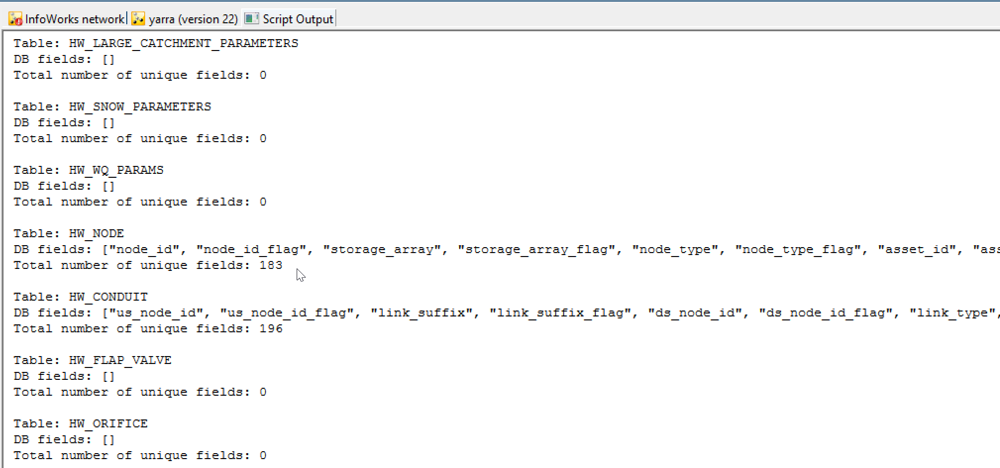

# List all results fields in a simulation
# Ruby Script: Print Table Results

This script is used to print the results of tables in both the current network and the background network in an InfoWorks ICM application.

## Steps

1. The script defines a method `print_table_results` that takes two parameters: `net` (the current network) and `bn` (the background network).

2. For each network, the script does the following:
   - Iterates over each table in the network.
   - For each table, it creates a new set `results_set` to store the unique field names.
   - It then iterates over each row object in the table.
   - For each row object, it checks if the table has results fields. If it does, it iterates over each field and adds the field name to `results_set`.
   - After iterating over all row objects, it prints the table name, the array of unique field names, and the total number of unique fields.

3. After defining the `print_table_results` method, the script gets the current network and the background network using the `WSApplication` class.

4. Finally, it calls the `print_table_results` method with the current network and the background network as arguments.



## Ruby Code

```ruby
# ... (code omitted for brevity)

# usage example
net = WSApplication.current_network
bn = WSApplication.background_network

# Print the table results
print_table_results(net,bn)

