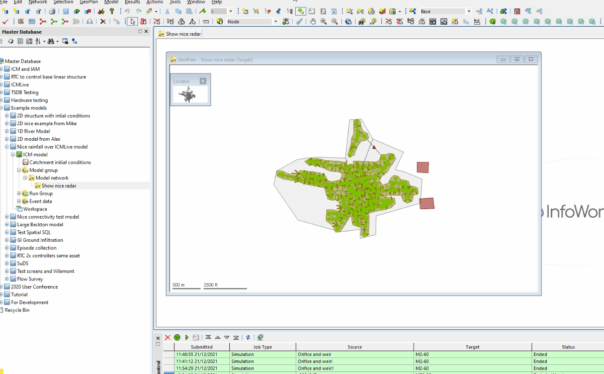

# Trace an open model network object tree to root object
The script in this example returns the `types`, `ids` and `names` of the database objects above the current active network. It also returns  `levels` in the tree relative to the root.

## Technical note
The core method in this script is `parent_object`. It can be applied to a `WSModelObject` class object, returning its parent model object in the tree. In turn, it can be used in the parent model object, returning the grandparent model object, and so on.

The script loops in this way up to 999 times (user defined) to gather information about the ancestry of an open network. It stores that information in a `genealogy` array as standardised hashes defined in the `object_specs(object)` user defind method. It goes up the database tree until it finds an object `id` of 0 and stops, meaning it's reached the root. Because it starts from the bottom up, the `genealogy` array is finally reversed in order, so that a `level` tag can be printed showing the different tree levels starting from the root.

Note that one of the first steps is to convert the `WSOpenNetwork` class object into a `WSModelObject` class object, using the `model_object` method. The `WSModelObject` class represents objects in the primary database and can access its tree structure for the `parent_object` method. This is unlike `WSOpenNetwork` class objects, which only represent the currently opened network.