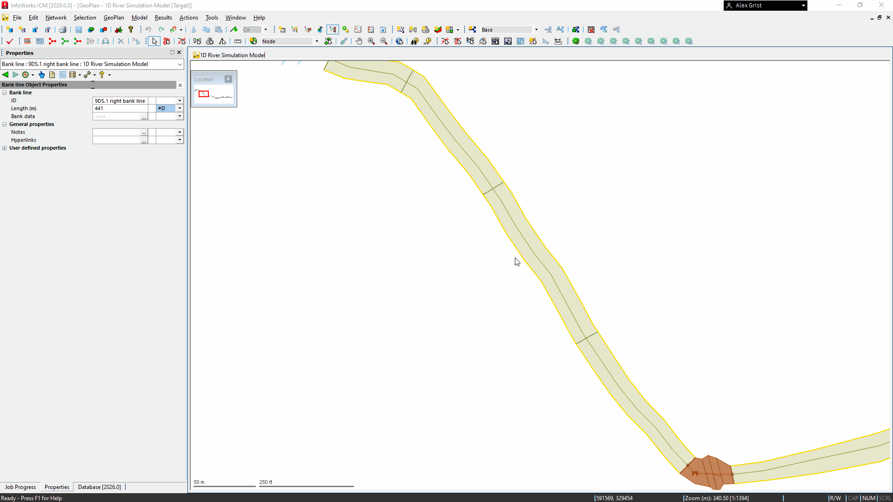

# Bank Line Data Cleaning Script
This script is designed to clean 'Bank line - Bank data' in an InfoWorks ICM model network. It checks for matches between bank line points and cross section line points, and updates the Z values accordingly. If no bank lines are selected, it processes all bank lines and selects them.

## How it Works

1. The script first accesses the current network.

2. It checks if any bank lines are selected. If none are selected, it informs the user via a message box and proceeds to process all bank lines. If bank lines are selected, it processes only the selected bank lines.

3. The script collects all bank line points into a bankpointsblob array. Each point includes the bank line ID, X, Y, Z values, and a reference to the bank line object.

4. It collects all cross section line points into a xspointsblob array, containing X and Y values for each point.

5. The script iterates over each bank point in bankpointsblob and checks for a matching X and Y coordinate in xspointsblob. If a match is found, it moves to the next bank point.

6. If no match is found for a bank point, the script sets its Z value to null and writes the updated bank line back to the network.

7. If no bank lines were selected initially, the script selects all bank lines in the network.

8. The script commits the transaction and displays a completion message with instructions for the next steps (customisable).

## Usage
To use this script, simply run it in the context of an open network in InfoWorks ICM. If you want to process specific bank lines, select them before running the script. The script will clean the bank line data and provide guidance for further actions.

## Completion Message
After the script completes its operation, it will display the following message: "Bank line data cleaned. Only cross section end levels remain. Next step: run the Model > Update from ground model… tool to populate missing values before building the River reaches."

This message guides you to the next steps required to finalize the bank line processing.

Feel free to reach out if you have any questions or need further assistance!