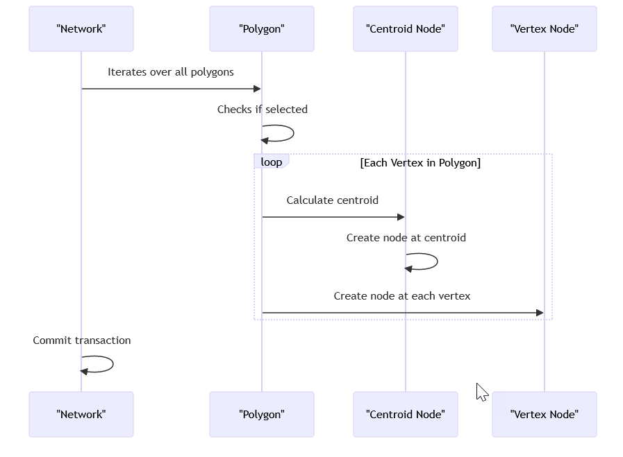

# Ruby Code for Generating Polygon Boundaries in InfoWorks ICM

This Ruby script is used to generate the boundaries for polygons with a specified number of sides in the InfoWorks ICM software. Here's a summary of what it does:

1. **Get the current network object**: The script starts by getting the current network object using `WSApplication.current_network`.

2. **Begin a transaction**: It then begins a transaction using `net.transaction_begin`. This allows all changes to be committed at once at the end of the script.

3. **Define a function to generate the boundary for a polygon**: The `generate_polygon_boundary` function is defined. This function takes a boundary array and a number of sides as arguments. It calculates the minimum and maximum x and y coordinates, the width and height, and then generates the points of the polygon. It returns the polygon boundary.

4. **Iterate over all polygon objects in the network**: The script then iterates over all polygon objects in the network using `net.row_object_collection('hw_subcatchment').each`. For each polygon, it checks if the polygon is selected. If it is, it gets the boundary array of the polygon, generates a new boundary array with a specified number of sides, and then sets the new boundary array.

5. **Commit the transaction**: Finally, the script commits the transaction using `net.transaction_commit`, making all changes permanent.



==============================================================
==============================================================

### Summary of 

swmm_UI_script.rb

#### Overview
This Ruby script is designed to modify the boundaries of polygon objects in a SWMM or ICM network. It prompts the user to select the network type and desired polygon shape, then updates the boundaries accordingly. All changes are committed in a single transaction for efficiency. Let's dive into the details, shall we?

#### Key Components

1. **Network Object Initialization**
   ```ruby
   net = WSApplication.current_network
   net.transaction_begin
   ```
   - **Translation**: Grabs the current network object and starts a transaction. Because who doesn't love committing all changes at once?

2. **Polygon Boundary Generation Function**
   ```ruby
   def generate_polygon_boundary(boundary_array, sides)
     # Calculate min/max coordinates, width, height, and points of the polygon
     # Close the shape and return the boundary array
   end
   ```
   - **Translation**: This function calculates the boundary for a polygon with a specified number of sides. It's like geometry class, but with more code and less chalk dust.

3. **User Prompt for Network Type and Shape Selection**
   ```ruby
   parameters = WSApplication.prompt "Select the network type and desired shape for the polygons",
   [
     ['Is this a SWMM network?', 'Boolean', true],
     ['Triangle (3-sided)', 'Boolean', false],
     ['Square (4-sided)', 'Boolean', false],
     ['Pentagon (5-sided)', 'Boolean', false],
     ['Hexagon (6-sided)', 'Boolean', false],
     ['Heptagon (7-sided)', 'Boolean', false],
     ['Octagon (8-sided)', 'Boolean', false],
     ['Nonagon (9-sided)', 'Boolean', false],
     ['Decagon (10-sided)', 'Boolean', false],
     ['Hendecagon (11-sided)', 'Boolean', false],
     ['Dodecagon (12-sided)', 'Boolean', false],
     ['Tridecagon (13-sided)', 'Boolean', false],
     ['Tetradecagon (14-sided)', 'Boolean', false],
     ['Pentadecagon (15-sided)', 'Boolean', true]
   ], false
   ```
   - **Translation**: Prompts the user to select whether the network is SWMM or ICM and choose a polygon shape. Because making decisions is fun, right?

4. **Determine Prefix and Number of Sides**
   ```ruby
   is_swmm_network = parameters[0]
   shape_selection = parameters[1..-1]
   prefix = is_swmm_network ? 'sw' : 'hw'
   sides = if shape_selection[0]
             3
           elsif shape_selection[1]
             4
           elsif shape_selection[2]
             5
           elsif shape_selection[3]
             6
           elsif shape_selection[4]
             7
           elsif shape_selection[5]
             8
           elsif shape_selection[6]
             9
           elsif shape_selection[7]
             10
           elsif shape_selection[8]
             11
           elsif shape_selection[9]
             12
           elsif shape_selection[10]
             13
           elsif shape_selection[11]
             14
           else
             15  # Default to a 15-sided polygon
           end
   ```
   - **Translation**: Determines the prefix (`sw` for SWMM, `hw` for ICM) and the number of sides for the polygon based on user input. Because who doesn't love a good conditional statement?

5. **Iterate and Update Polygon Boundaries**
   ```ruby
   net.row_object_collection("#{prefix}_subcatchment").each do |polygon|
     if polygon.selected?
       boundary_array = polygon.boundary_array
       polygon.boundary_array = generate_polygon_boundary(boundary_array, sides)
       polygon.write
     end
   end
   net.transaction_commit
   ```
   - **Translation**: Iterates over all selected polygons, updates their boundaries based on the chosen shape, and commits the changes. It's like a makeover for polygons, but with less glitter.

#### Conclusion
This script is a nifty tool for updating polygon boundaries in SWMM or ICM networks. It combines user input, geometric calculations, and efficient transaction handling to get the job done. And let's be honest, who doesn't love a good polygon transformation?